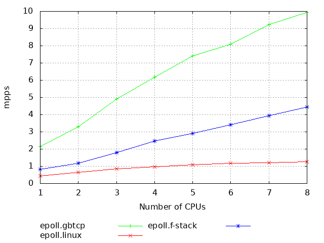

# gbtcp -- Gigabit TCP 

## Status
PoC

## Build
- Build and install netmap. See https://github.com/luigirizzo/netmap

- Build and install gbtcp
```bash
./configure # -d for debug
make
make install
```

## Configure environment

Create configuration file and put it in /usr/local/gbtcp/sysctl/. See example.conf

Each application use it's own file. For example nginx - /usr/local/gbtcp/sysctl/nginx.conf

Minimal configuration file:
```bash
route.if.add=eth
```
Where eth is name of ethernet adapter

### Linux

```bash
ethtool -K eth2 rx off tx off
ethtool -K eth2 gso off
ethtool -L eth2 combined 8
ethtool -K eth2 ntuple on
ethtool --show-ntuple eth2 rx-flow-hash tcp4
ethtool -N eth2 rx-flow-hash tcp4 sdfn
ethtool -N eth2 rx-flow-hash udp4 sdfn
```

### FreeBSD
```bash
hw.ix.num_queues=8 # /boot/loader.conf
ifconfig re0 -rxcsum -txcsum
```

## Run

```bash
LD_PRELOAD=./bin/libgbtcp.so nginx -c /etc/nginx.conf
```

## Notes
* LD_PRELOAD cannot be used with setuid

* Run tcpdump. tcpdump must be started after netmap application
```bash
LD_PRELOAD=libpcap.so.1.6.0-PRE-GIT tcpdump -Snni 'netmap:eth2^/rt'
```

* For maximal performance set scaling_governor
```bash
echo performance > /sys/devices/system/cpu/cpu0/cpufreq/scaling_governor
...
echo performance > /sys/devices/system/cpu/cpuX/cpufreq/scaling_governor

```

* Create plots
```bash
./tools/make_plot.sh -i ./tools/benchmark_reults/2020-07-13 5,epoll.gbtcp,green 7,epoll.linux,red 9,epoll.f-stack,blue
```

## Benchmarks

DUT:

    Ethernet controller: Intel Corporation 82599ES 10-Gigabit SFI/SFP+
    CPU: AMD FX(tm)-8350 Eight-Core Processor
    OS: CentOS Linux release 7.6.1810
    Kernel: 4.19.69

Traffic Generator:

```bash
./con-gen -S 00:1b:21:95:69:64 -D 00:1B:21:A6:E5:3C -s 1.1.2.10 -d 1.1.2.1  -a 0 -p 80 -c 1000 -i 'eth2-0' --toy -- -s 1.1.2.11  -i 'eth2-1' -a 1 -- -s 1.1.2.12 -i 'eth2-2' -a 2 -- -s 1.1.2.13 -i 'eth2-3' -a 3
```





